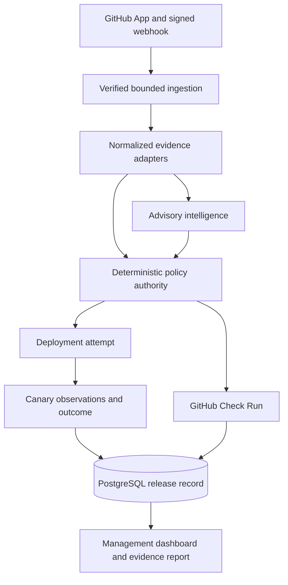

# Architecture

## Architecture diagram

## Component responsibilities

| Boundary | Owns | Must not own |
|---|---|---|
| GitHub receiver | signature validation, delivery replay protection, event parsing | release authority |
| Evidence adapters | bounded normalized facts and source attribution | raw artifact retention or policy mutation |
| Intelligence engine | advisory risk, explanation, usage telemetry | final release decision |
| Policy engine | deterministic decision, strategy, traffic percentage, override codes | model prompts or provider calls |
| Deployment lifecycle | attempts, observations, continuation, promotion, rollback | changing policy |
| PostgreSQL stores | correlated releases, audit, authorization, outcomes, reports | plaintext API credentials |
| Management surface | read-only review and evidence export; explicit operator actions | anonymous release data |

## Release identity and ordering

Repository owner/name, pull-request number, head SHA, workflow run, release UUID, and deployment-attempt UUID are validated and correlated. Deployment events are accepted only in a legal chronological state. Replays are idempotent; conflicting reuse fails closed.

## Deployment topology

The service is a TypeScript/Node application. Local container validation places stable and canary services behind Nginx with deterministic 5% or 10% canary routes. Production is deployed through Render, and `/version` exposes the exact `RENDER_GIT_COMMIT`. GitHub Actions waits for that revision and verifies `/health` before deployment succeeds.

Customer lead qualification uses a separate authenticated Cloudflare Worker relay and Resend sending domain. The application sends only the configured recipient, fixed subject, lead UUID, qualification time, and idempotency key; contact details and challenge text do not cross that boundary.
